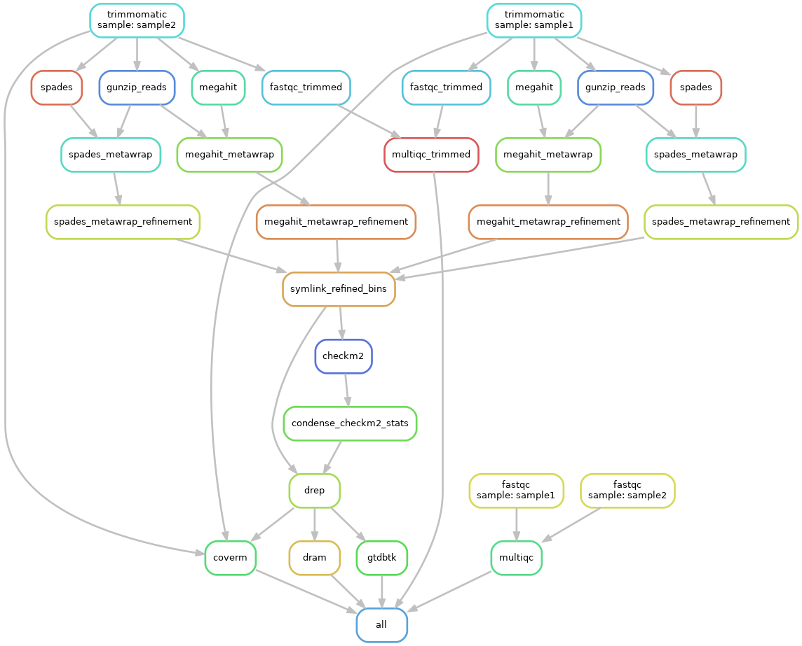

# Pipeline to acquire metagenome-assembled genomes (MAGs) from environmental DNA sequencing data

This repository documents the current process used by the Pachiadaki lab at Woods Hole Oceanographic institutions to assemble and characterize prokaryotic MAGs from metagenomic reads.  The snakemake pipeline contains the following high-level steps:

* Read trimming and quality assessment using [trimmomatic](https://pmc.ncbi.nlm.nih.gov/articles/PMC4103590/), [FastQC](https://www.bioinformatics.babraham.ac.uk/projects/fastqc/) and [MultiQC](https://github.com/MultiQC/MultiQC)
* Genome assembly using both [Megahit](https://academic.oup.com/bioinformatics/article/31/10/1674/177884) and [Spades](https://pmc.ncbi.nlm.nih.gov/articles/PMC5411777/) 
* Grouping metagenomic contigs into bins based on their predicted source using [MetaWRAP](https://microbiomejournal.biomedcentral.com/articles/10.1186/s40168-018-0541-1)
* Bin quality assessment using [CheckM2](https://www.nature.com/articles/s41592-023-01940-w)
* Generation of a non-redundant bins set using [dRep](https://www.nature.com/articles/ismej2017126)
* Taxonomic classification of bins using [GTDB-Tk](https://pmc.ncbi.nlm.nih.gov/articles/PMC7703759/)
* Protein prediction and functional characterization of bins using [DRAM](https://academic.oup.com/nar/article/48/16/8883/5884738)
* Determination of bin relative abundance using [CoverM](https://github.com/wwood/CoverM)

The directed acyclic graph is illustrated below for a simple two-sample dataset:

Currently, the pipeline involves three conda environments detailed in the env_yamls folder.  It should be run in the environment detailed in main.yaml, then the paths to auxiliary environments indicated in config.yaml.  Running this pipeline requires creating all three of the appropriate conda environments, then modifying config.yaml to point to your read input folder, Illumina adapters file and environment locations. 
